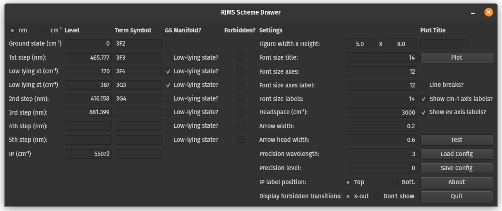

# RIMSSchemeDrawer
A drawing program to create publishable RIMS schemes.  

Help with the installation / compilation can be found [here](INSTALLATION.md).

## How to use

Generally, the GUI should be fairly self explaning. Tool tips are futhermore implemented to help you navigate what you need to do.

Below is an screenshot of the main window in the software that is configured to mostly reproduce the Titanium resonance ionization scheme published by [Trappitsch et al. (2018)](https://doi.org/10.1039/C8JA00269J). Note that the actual figure published was created with a previous version of the RIMSSchemeDrawer software.

### State / transition information

Information on the transitions are entered on the left hand side of the software. You can select if you would like to enter the information in nm (wavelength) or in cm-1 (wavenumbers). The term symbols can also be given, but are optional. Furthermore, if you have low-lying states, check the according box and you can now add the associated information.

### Plotting

On the right hand side of the program are the settings. Many parameters of the plot can be configured here. It is worth playing with various parameters. The `Plot` button will quickly allow you to see the figure in a pop up. 

In order to save the figure, click `Save Plot`. Now you can enter a filename. The format of the file is defined by the ending that you type in. If you choose a vecotr graphics format such as `svg` or `pdf`, the plot will automatically be saved as a scalable vector graphics. More information on formats can be found [here](https://matplotlib.org/3.2.1/api/_as_gen/matplotlib.pyplot.savefig.html). 

In the background, RIMSSchemeDrawer uses matplotlib to draw the figures and to display them nicely. Feel free to tinker with the code and explore additional styles.

### Loading and saving configurations

If you want to load / save the configurations you can use the according `Load Config` and `Save Config` buttons. The data is saved as a `json` file. You can open a saved file with any text editor and have a look, but please note that bad things can happen if you change the file right there, unless of course you know what you're doing. The file should be fairly self-explanatory. 

If you are interested: The file with the configurations shown in the image above can be found [here](examples/example_titanium.json).

## Issues / enhancements

If you find bugs in the software or would like to have an additional feature, please use github's Issue capability to create an appropriate request. Please also browse the issues to first see if the bug / feature request you want to report is already listed. Feel free to join the discussion in this case!

If you furthermore have ideas on how to implement / fix the bug already, please feel free to discuss it throuh in the Issues tab and create a pull request. Please follow [best practices](https://chris.beams.io/posts/git-commit/) in your commit messages.
